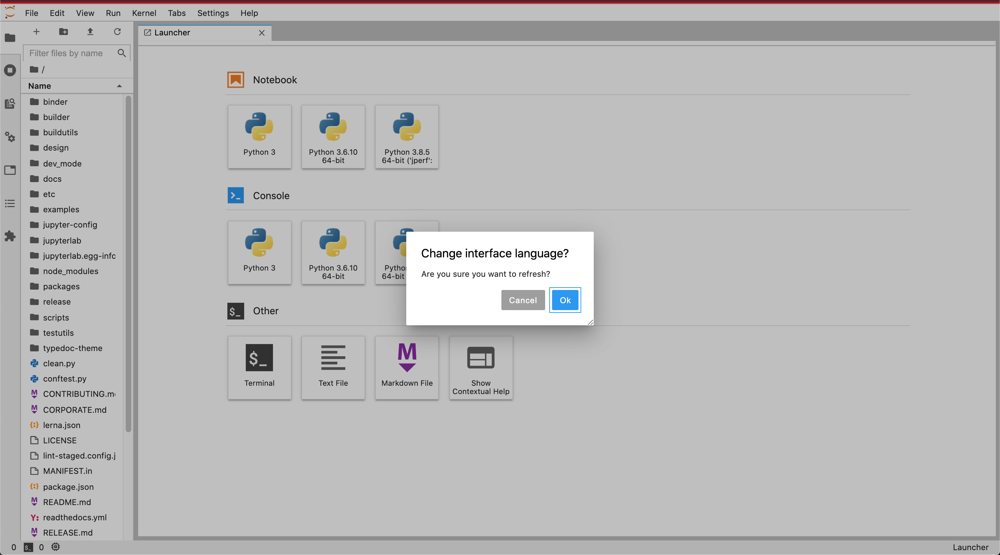

# Localization workflow

## Setting the development environment

### Create conda environment

```bash
conda create -n jlab python nodejs -c conda-forge -y -q
conda activate jlab
```

### Install example language packs

First make a fork of `https://github.com/jupyterlab/language-packs`

Then we clone the fork and add the `upstream` remote to point to the original repo
`https://github.com/jupyterlab/language-packs`

```bash
git clone https://github.com/<github-username>/language-packs
cd language-packs
git remote add upstream https://github.com/jupyterlab/language-packs
```

Now we can install the chinese language pack (the most complete to date)

```bash
cd language-packs/jupyterlab-language-pack-zh_CN
pip install -e .
cd ..
cd ..
cd ..
```

These language packs will also soon include grammar dictionaries as well
and will be available as pip/conda installable packages.

With the new work on the Extension Manager on JupyterLab, users will also
be able to install the language packs directly from JupyterLab.

### Install JupyterLab for development

First make a fork of `https://github.com/jupyterlab/jupyterlab`

Then we clone the fork and add the `upstream` remote to point to the original repo
`https://github.com/jupyterlab/jupyterlab`

```bash
git clone https://github.com/<github-username>/jupyterlab.git
cd jupyterlab
git remote add upstream https://github.com/jupyterlab/jupyterlab.git
```

Now we can install JupyterLab for local development.

```bash
pip install -e .
jlpm
jlpm run build
```

### Run JupyterLab

Now we can run JupyterLab in `dev-mode` by executing:

```bash
jupyter lab --dev-mode
```

A new browser tab will open in your default browser where JLab will start.

You should see something like this:


You should be able to see and select chinese from the `Settings/Language` Menu.


And this is how it looks!


## Localizing examples in the JupyterLab repository

TODO:

## Localizing extension examples repository

TODO:
